# Prácticas 1 y 2 - Scripts de Movimiento

**Asignatura:** Interfaces Inteligentes  
**Universidad:** Universidad de La Laguna  
**Titulación:** Grado en Ingeniería Informática  
**Curso:** 2026/2027  
**Fecha:** 2 de octubre de 2026

Repositorio con los scripts desarrollados para los ejercicios de movimiento en Unity. Cada ejercicio incluye una descripción de lo implementado, los hitos relevantes y una prueba de ejecución en GIF.

## Estructura del repositorio

```
.
├── docs
│   └── Ejercicios Scripts - Movimiento.pdf
├── gifs
│   ├── ejercicio_1.gif
│   ├── ejercicio_10.gif
│   ├── ejercicio_11.gif
│   ├── ejercicio_12.gif
│   ├── ejercicio_13.gif
│   ├── ejercicio_2.gif
│   ├── ejercicio_3.gif
│   ├── ejercicio_4.gif
│   ├── ejercicio_5.gif
│   ├── ejercicio_6.gif
│   ├── ejercicio_7.gif
│   ├── ejercicio_8.gif
│   └── ejercicio_9.gif
├── readme.md
└── scripts
    ├── ChangeColor.cs
    ├── CubeChaser.cs
    ├── CubeConstantMovement.cs
    ├── CubeMover.cs
    ├── CubeTurner.cs
    ├── DistanceToObjects.cs
    ├── PositionSetter.cs
    ├── SpeedDebugger.cs
    ├── SphereMover.cs
    └── VectorOperations.cs
```

## Índice

1. [Ejercicio 1: Color aleatorio cada N frames](#ejercicio-1)
2. [Ejercicio 2: Operaciones con vectores](#ejercicio-2)
3. [Ejercicio 3: Posición de la esfera](#ejercicio-3)
4. [Ejercicio 4: Distancia del cubo y el cilindro a la esfera](#ejercicio-4)
5. [Ejercicio 5: Reubicar objetos con la barra espaciadora](#ejercicio-5)
6. [Ejercicio 6: Velocidad por los ejes en consola](#ejercicio-6)
7. [Ejercicio 7: Mapear la tecla H al disparo](#ejercicio-7)
8. [Ejercicio 8: Movimiento constante del cubo](#ejercicio-8)
9. [Ejercicio 9: Mover el cubo y la esfera con el teclado](#ejercicio-9)
10. [Ejercicio 10: Movimiento proporcional al tiempo del frame](#ejercicio-10)
11. [Ejercicio 11: El cubo persigue a la esfera](#ejercicio-11)
12. [Ejercicio 12: El cubo avanza mirando a la esfera](#ejercicio-12)
13. [Ejercicio 13: Girar con el eje Horizontal y avanzar hacia delante](#ejercicio-13)

<a id="ejercicio-1"></a>
## Ejercicio 1: Color aleatorio cada N frames

**Script:** [`ChangeColor.cs`](./scripts/ChangeColor.cs)

**Qué hace:** inicializa un vector de 3 posiciones con valores entre 0.0 y 1.0, que se interpreta como color RGB. Cada `waitingFrames` frames elige una posición aleatoria del vector, le asigna un nuevo valor aleatorio y aplica el color resultante al material del objeto.

**Hitos relevantes:**
- Variable pública `waitingFrames` (por defecto 120), editable desde el inspector.
- Uso de `Random.Range(0, 3)` para elegir la posición y `Random.Range(0f, 1f)` para el nuevo valor.
- Un contador de frames en `Update()` que se reinicia al llegar al valor configurado.
- El color se asigna con `GetComponent<Renderer>().material.color = new Color(values[0], values[1], values[2])`.

**Prueba de ejecución:**

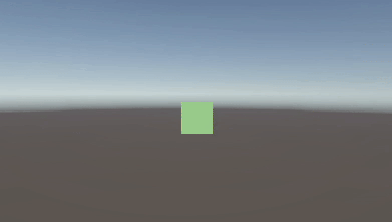

<a id="ejercicio-2"></a>
## Ejercicio 2: Operaciones con vectores

**Script:** [`VectorOperations.cs`](./scripts/VectorOperations.cs)

**Qué hace:** declara dos `Vector3` públicos cuyos componentes se configuran desde el inspector y muestra por consola:

- **a)** La magnitud de cada vector (`Vector3.magnitude`).
- **b)** El ángulo que forman (`Vector3.Angle(v1, v2)`).
- **c)** La distancia entre ambos (`Vector3.Distance(v1, v2)`).
- **d)** Un mensaje indicando cuál de los dos está a mayor altura (comparando la componente `y`).

**Hitos relevantes:**
- Los resultados se guardan también en variables públicas (`magnitudeA`, `magnitudeB`, `angle`, `distance`) para verlos en el inspector.
- Se controla el caso en que las alturas son iguales.

**Prueba de ejecución:**

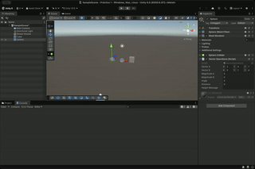

<a id="ejercicio-3"></a>
## Ejercicio 3: Posición de la esfera

**Script:** [`VectorOperations.cs`](./scripts/VectorOperations.cs)

**Qué hace:** muestra por consola el vector con la posición de la esfera.

**Hitos relevantes:**
- La posición es una propiedad del componente `Transform`, que se obtiene con `transform.position`.
- Se prueban las dos alternativas del enunciado: `GetComponent<Transform>().position` y `transform.position`, que dan el mismo resultado.
- La posición se guarda en la variable pública `spherePosition` y se actualiza en `Update()` para verla en el inspector.

**Prueba de ejecución:**

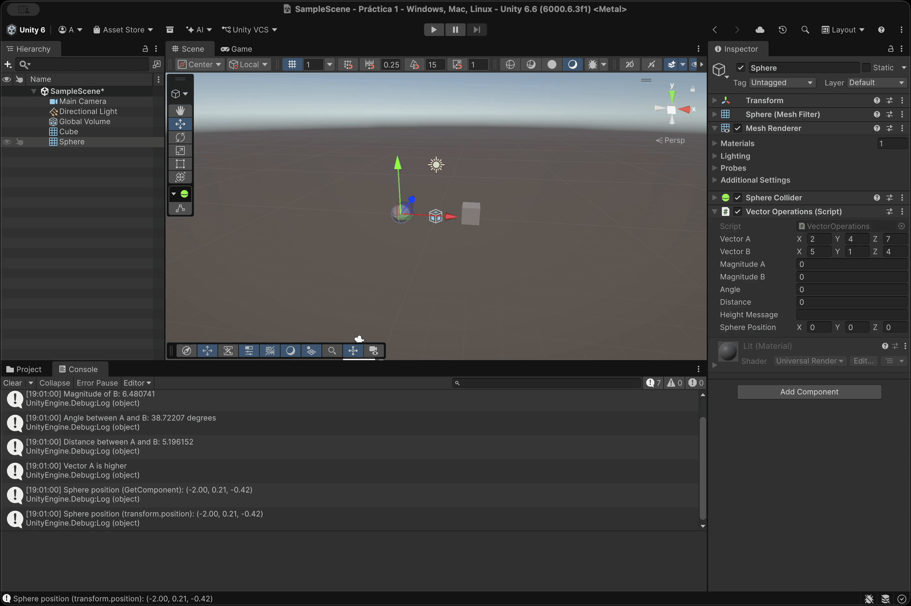

<a id="ejercicio-4"></a>
## Ejercicio 4: Distancia del cubo y el cilindro a la esfera

**Script:** [`DistanceToObjects.cs`](./scripts/DistanceToObjects.cs)

**Qué hace:** muestra en consola la distancia a la que están el cubo y el cilindro respecto a la esfera.

**Hitos relevantes:**
- El cubo y el cilindro se localizan por etiqueta con `GameObject.FindWithTag("cube")` y `GameObject.FindWithTag("cylinder")`.
- A partir del `GameObject` se obtiene su `Transform` y se calcula `Vector3.Distance(transform.position, cubeTransform.position)`.
- Las distancias se guardan en variables públicas y se recalculan en `Update()`, de modo que se pueden seguir en el inspector mientras los objetos se mueven.
- Se necesita asignar las etiquetas `cube` y `cylinder` al cubo y al cilindro en el editor.

**Prueba de ejecución:**

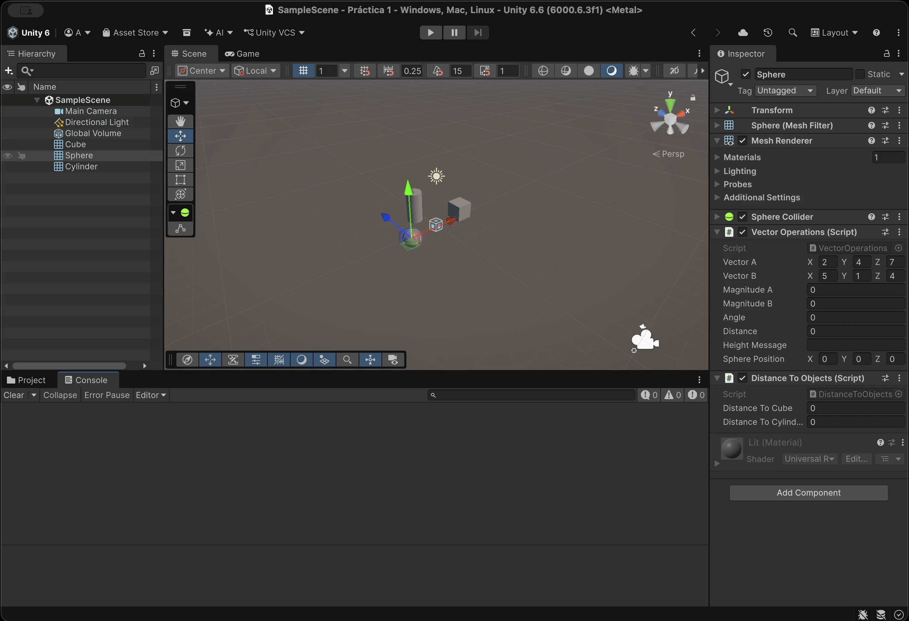

<a id="ejercicio-5"></a>
## Ejercicio 5: Reubicar objetos con la barra espaciadora

**Script:** [`PositionSetter.cs`](./scripts/PositionSetter.cs)

**Qué hace:** un objeto invisible (marcador) contiene un array de 3 `Vector3` (`offsets`) que representan desplazamientos respecto a la posición original de tres objetos de la escena. Al pulsar la barra espaciadora, cada objeto se coloca en su posición original más el desplazamiento correspondiente.

**Hitos relevantes:**
- Los tres objetos se asignan desde el inspector mediante referencias a `Transform` (`objectA`, `objectB`, `objectC`).
- En `Start()` se guardan las posiciones iniciales, de forma que el desplazamiento siempre se calcula respecto al origen y no se acumula si se pulsa varias veces.
- La pulsación se detecta con `Input.GetAxis("Jump") > 0`, ya que el eje `Jump` está asociado por defecto a la barra espaciadora.
- Los desplazamientos son editables desde el inspector en el marcador.

**Prueba de ejecución:**

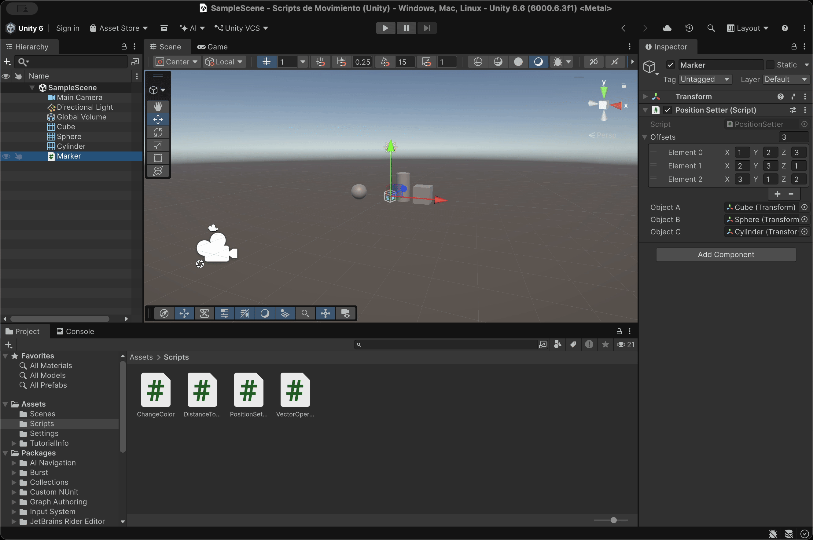

<a id="ejercicio-6"></a>
## Ejercicio 6: Velocidad por los ejes en consola

**Script:** [`SpeedDebugger.cs`](./scripts/SpeedDebugger.cs)

**Qué hace:** el cubo tiene un campo `speed` editable desde el inspector. Cada vez que se pulsa una flecha, se muestra en consola un mensaje que empieza por el nombre de la flecha seguido del resultado de multiplicar la velocidad por el valor del eje correspondiente (`Vertical` para arriba/abajo, `Horizontal` para izquierda/derecha).

**Hitos relevantes:**
- Se usa `Input.GetKeyDown(KeyCode.UpArrow)` y similares para detectar la pulsación una sola vez por tecla, y `Input.GetAxis("Vertical")` / `Input.GetAxis("Horizontal")` para leer el valor del eje.
- Los mensajes comienzan por `Up Arrow`, `Down Arrow`, `Left Arrow` o `Right Arrow`, según lo pedido.
- `GetAxis` aplica suavizado, por lo que en el frame de la pulsación el valor del eje aún no ha llegado a ±1 y el resultado es menor que `speed`. Con `GetAxisRaw` se obtendría directamente ±1.
- El proyecto debe estar configurado con el Input System (Old): *Edit → Project Settings → Player → Other → Active Input Handling*.

**Prueba de ejecución:**

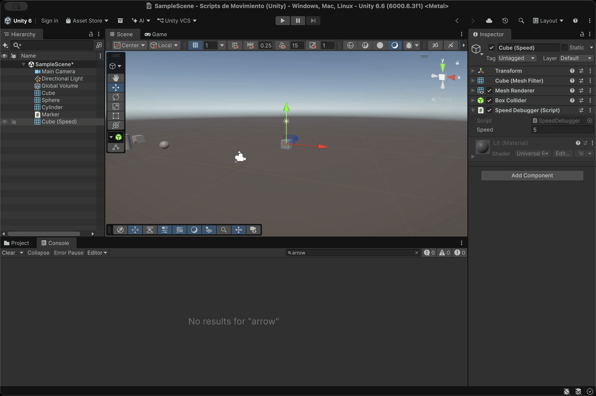

<a id="ejercicio-7"></a>
## Ejercicio 7: Mapear la tecla H a la función disparo

**Script:** no requiere script; se resuelve con el Input Manager de Unity.

**Qué hace:** redefine el mapeo por defecto del eje de disparo para que la tecla `H` lo active.

**Hitos relevantes:**
- Se abre *Edit → Project Settings → Input Manager → Axes*.
- En el eje `Fire1` se cambia el campo `Positive Button` (o `Alt Positive Button`) a `h`.
- A partir de ese momento, `Input.GetButton("Fire1")` y `Input.GetButtonDown("Fire1")` responden a la tecla `H`.

**Prueba de ejecución:**

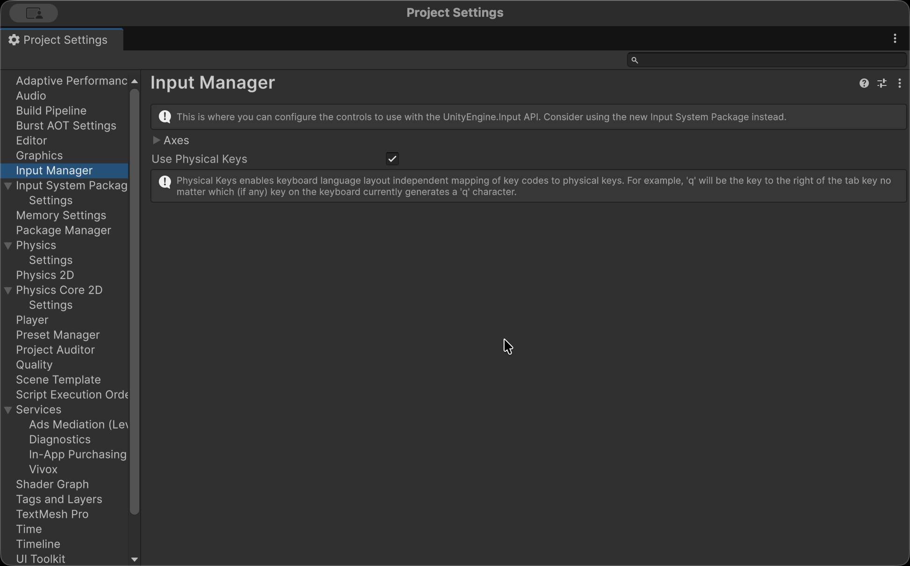

<a id="ejercicio-8"></a>
## Ejercicio 8: Movimiento constante del cubo

**Script:** [`CubeConstantMovement.cs`](./scripts/CubeConstantMovement.cs)

**Qué hace:** en cada iteración de `Update()` traslada el cubo una cantidad proporcional al vector `moveDirection`, escalado por `speed`, con `transform.Translate(moveDirection * speed, referenceSpace)`.

**Hitos relevantes:**
- `moveDirection` (`Vector3`), `speed` (`float`) y `referenceSpace` (`Space.Self` o `Space.World`) son públicos y se editan desde el inspector.
- El movimiento no usa `Time.deltaTime`, por lo que depende de los frames por segundo.
- Para las pruebas el cubo parte de `y = 0` y con una velocidad inicial mayor que 1.

**Resultados de cada situación:**

**a) Duplicar las coordenadas de la dirección:** el desplazamiento por frame se duplica, ya que se multiplica por el vector completo. El cubo recorre el doble de distancia en la misma dirección y se mueve el doble de rápido.  
**b) Duplicar la velocidad manteniendo la dirección:** el resultado es el mismo que en el caso anterior, porque el desplazamiento es el producto `moveDirection * speed`. Ambas magnitudes se combinan multiplicándose, así que duplicar cualquiera de las dos duplica el avance.  
**c) Velocidad menor que 1:** el cubo avanza en sentido contrario.  
**d) Posición del cubo con y > 0:** la altura inicial no cambia el comportamiento del movimiento, porque `Translate` desplaza el objeto relativamente a su posición actual. El cubo se mantiene a esa altura, sin caer, ya que no hay `Rigidbody` ni gravedad, y solo cambia de altura si `moveDirection` tiene componente `y`.  
**e) Sistema de referencia local frente a mundial:** se puede ver como varía ligeramente la dirección de movimiento del cubo.

**Prueba de ejecución:**


<a id="ejercicio-9"></a>
## Ejercicio 9: Mover el cubo y la esfera con el teclado

**Scripts:** [`CubeMover.cs`](./scripts/CubeMover.cs) y [`SphereMover.cs`](./scripts/SphereMover.cs)

**Qué hace:** el cubo se mueve con las flechas (arriba-abajo para el eje vertical, izquierda-derecha para el horizontal) y la esfera con las teclas `W`/`S` (vertical) y `A`/`D` (horizontal), ambos a la velocidad `speed`.

**Hitos relevantes:**
- Se leen las teclas con `Input.GetKey(KeyCode.X)` y se construyen los valores `horizontal` y `vertical` (-1, 0 o 1).
- El desplazamiento se aplica con `transform.Translate(x, y, 0f)`.
- `speed` es público, por lo que puede ajustarse en el inspector de cada objeto.
- Esta versión del ejercicio aplica el desplazamiento directamente por frame; los scripts del repositorio ya incluyen la mejora con `Time.deltaTime` del ejercicio siguiente.

**Prueba de ejecución:**

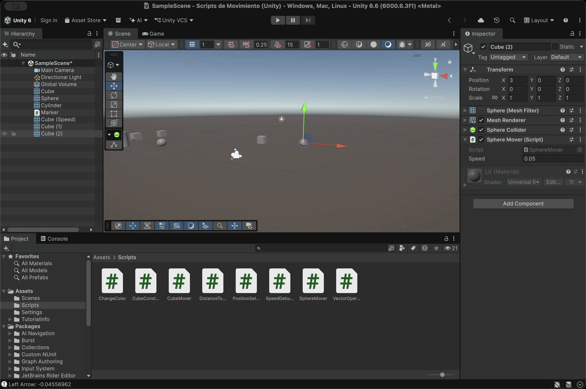

<a id="ejercicio-10"></a>
## Ejercicio 10: Movimiento proporcional al tiempo del frame

**Scripts:** [`CubeMover.cs`](./scripts/CubeMover.cs) y [`SphereMover.cs`](./scripts/SphereMover.cs)

**Qué hace:** adapta el movimiento del ejercicio 9 para que el espacio recorrido dependa del tiempo transcurrido entre frames, y no de la cantidad de frames por segundo.

**Hitos relevantes:**
- Cada componente del desplazamiento se multiplica por `Time.deltaTime`: `horizontal * speed * Time.deltaTime`.
- Con esto `speed` pasa a expresar unidades por segundo, y el objeto se mueve a la misma velocidad en equipos con distinta tasa de refresco.

**Prueba de ejecución:**

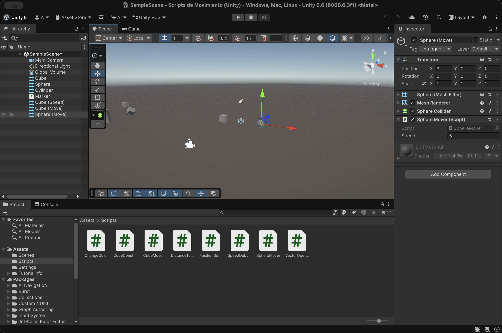

<a id="ejercicio-11"></a>
## Ejercicio 11: El cubo persigue a la esfera

**Script:** [`CubeChaser.cs`](./scripts/CubeChaser.cs)

**Qué hace:** el cubo se desplaza hacia la posición de la esfera a velocidad constante, sin importar la distancia que los separe y sin modificar su altura.

**Hitos relevantes:**
- La esfera se localiza por etiqueta con `GameObject.FindWithTag("sphere")` y se obtiene su `Transform`. Es necesario etiquetar la esfera con `sphere`.
- La dirección es el vector que une ambos objetos: `sphere.position - transform.position`.
- Se anula la componente vertical (`direction.y = 0f`) para que el cubo mantenga su altura.
- El vector se normaliza con `direction.normalized`, de modo que el avance no depende de la distancia.
- Se desplaza con `Translate(direction * speed * Time.deltaTime, Space.World)`.

**Prueba de ejecución:**

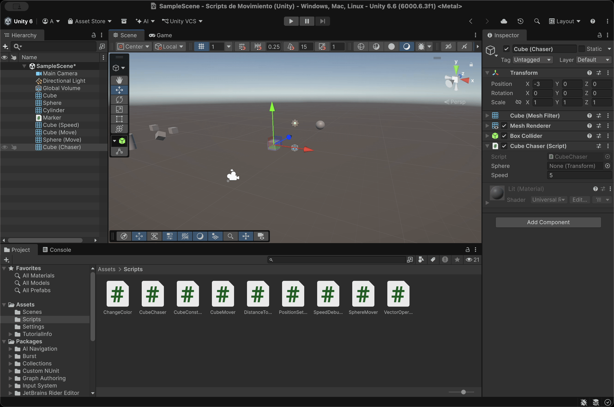

<a id="ejercicio-12"></a>
## Ejercicio 12: El cubo avanza mirando a la esfera

**Script:** [`CubeChaser.cs`](./scripts/CubeChaser.cs)

**Qué hace:** amplía el ejercicio 11 para que el cubo gire de forma que su eje Z positivo apunte siempre a la esfera mientras avanza hacia ella. La esfera se mueve con las teclas `W`, `A`, `S`, `D` para comprobar que el cubo la sigue.

**Hitos relevantes:**
- Se añade `transform.LookAt(sphere)`, que rota el cubo para que su vector `forward` apunte al objetivo.
- Como el cubo ya está rotado, el desplazamiento se hace en `Space.World`; con `Space.Self` la dirección calculada en coordenadas del mundo se reinterpretaría con los ejes locales y el movimiento sería incorrecto.
- Si la esfera está a distinta altura, `LookAt` inclina el cubo hacia ella, pero el cubo no cambia de altura porque la dirección de avance sigue teniendo `y = 0`.
- Se prueba moviendo la esfera con `SphereMover.cs`.

**Prueba de ejecución:**


<a id="ejercicio-13"></a>
## Ejercicio 13: Girar con el eje Horizontal y avanzar hacia delante

**Script:** [`CubeTurner.cs`](./scripts/CubeTurner.cs)

**Qué hace:** el eje `Horizontal` (flechas izquierda/derecha o `A`/`D`) hace girar el objeto sobre el eje Y, y el objeto avanza continuamente en la dirección hacia la que está orientado.

**Hitos relevantes:**
- El giro se aplica con `transform.Rotate(0f, horizontal * rotationSpeed * Time.deltaTime, 0f)`, con `rotationSpeed` en grados por segundo.
- La dirección de avance se obtiene con la propiedad `transform.forward` (no confundir con `Vector3.forward`, que es siempre el eje Z del mundo).
- El desplazamiento se hace en `Space.World`, porque `transform.forward` ya está expresado en coordenadas del mundo.
- `Debug.DrawRay(transform.position, transform.forward * 3f, Color.red)` dibuja en la vista *Scene* un rayo rojo que muestra hacia dónde avanza el objeto, útil para depurar.

**Prueba de ejecución:**

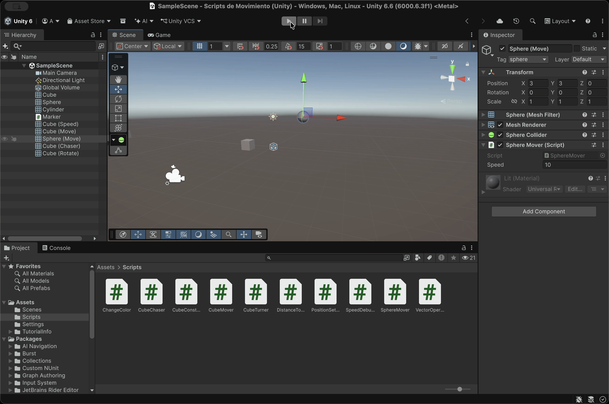
